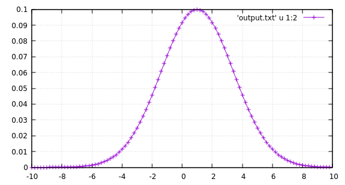

# demo_optimize
This is a self-contained example for a Python wrapper around some stand-alone code for optimization.

## Stand-alone code
Suppose you have some stand-alone code written in e.g. C or Fortran.
It may expect you to put the input parameters in some (text) file
and (if successful) generate (some) output file(s).

This repository contains an example of such a code in [`main_objective.c`](https://github.com/jonathanschilling/demo_optimize/blob/master/main_objective.c).
It can be compiled with `gcc` using the following command:
```bash
gcc main_objective.c -o main_objective.c -lm
```

This particular example computes a Gaussian bell shape for given `mean`, `sigma` and `amplitude`
at 100 points between `mean-3*sigma` and `mean+3*sigma`.
An example input file is [`input.txt`](https://github.com/jonathanschilling/demo_optimize/blob/master/input.txt).
It contains three lines for `mean=10.0`, `sigma=2.4` and `amplitude=0.1`.
The outputs are written to a file called [`output.txt`](https://github.com/jonathanschilling/demo_optimize/blob/master/output.txt)
in the folder where the code is called from.

Execute the code as follows:
```bash
./main_objective input.txt
```

The output of the code can be plotted using e.g. `gnuplot`:


## Python wrapper
A Python wrapper that can organize execution of this code is found in the first part of [`demo_minimize.py`](https://github.com/jonathanschilling/demo_optimize/blob/master/demo_minimize.py).

Given the vector of input parameters, it generates the input file for your code.
The input file is generated in a temporary working directory and its [MD5 hash](https://en.wikipedia.org/wiki/MD5) is computed.
The MD5 hash is a unique but reproducable ID assigned to the input file and only depends on its contents.
If these inputs have already been fed to your code (and it reproduces the output exactly for a given input),
there is no need to re-execute the code for this input file.

If a folder named after the MD5 sum of the input file containing the current input parameters is found,
it is assumed that the code was already run with these parameters and that the output file is ready to be read.
If such a folder is not found, it is assumed that the current set of input parameters was not executed yet
and a new run folder is created, the temporary input file is moved into it and the code is executed within the run folder.

---

The second part of the python wrapper script uses above infrastructure
to run your code over and over again until some objective function is optimized.
This is a simple mock-up example of much more powerful optimization frameworks,
such as e.g. [`SIMSOPT`](https://github.com/hiddenSymmetries/simsopt).

